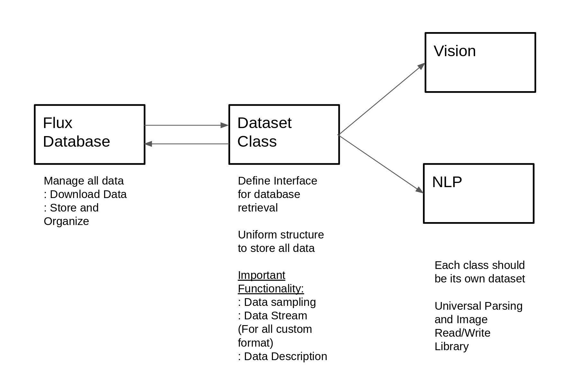

# Design Doc for Flux

## Flux Database

- Create a general format for data storage.  (For now, tf records)

## Dataset Class

- For general implementation, look at [dataset.py](../datasets/dataset.py)

#### TODO:
- Implement sample for each dataset

### Vision
- cifar
- mnist

### NLP
- newslens
- squad
